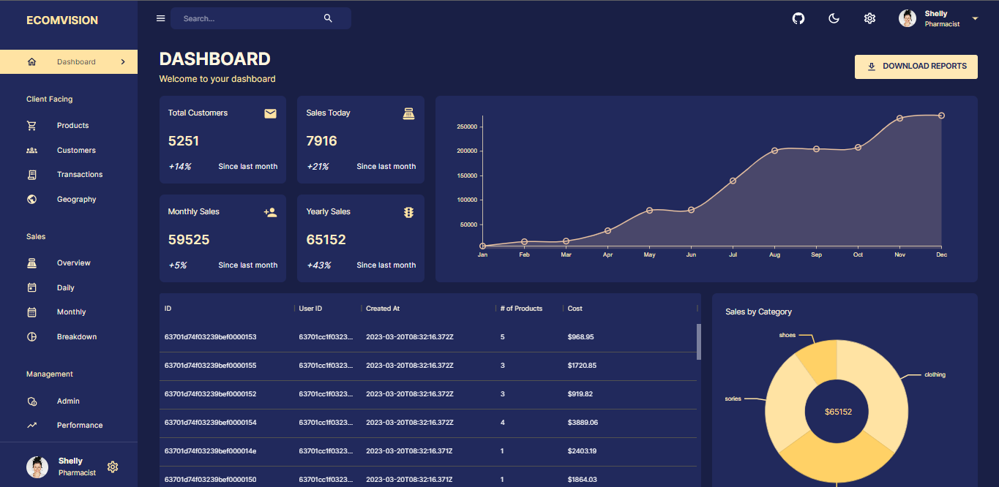
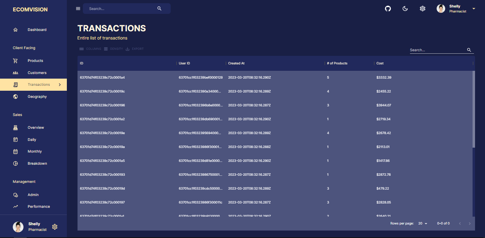
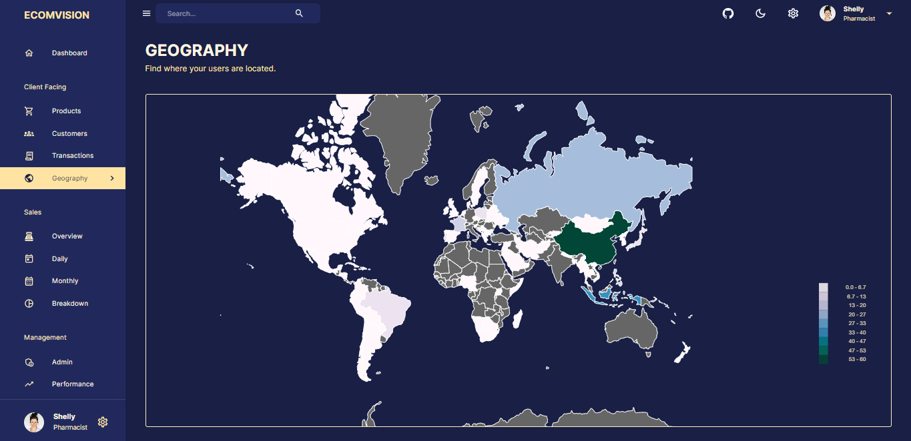
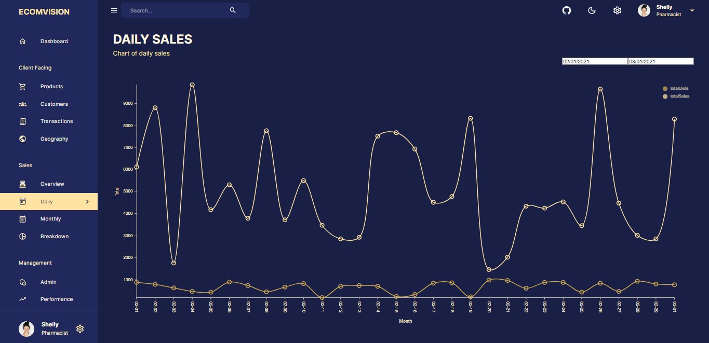
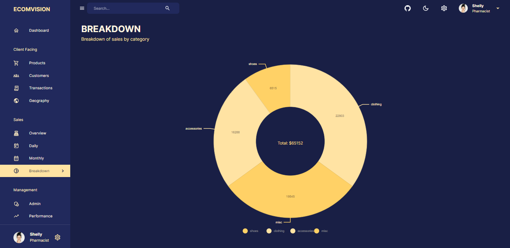

# Intelli-Dash

A modern, full stack admin dashboard built with the MERN stack (MongoDB, Express, React, Node.js) and Material UI. Features a beautiful, responsive UI and powerful analytics for business management.


## Features
- Dark & light theme
- Responsive layout
- Dashboard with analytics
- Products, customers, transactions, geography, and sales pages
- Customizable charts and data grids
- Modern Material UI design

## UI Previews











## Tech Stack
- React
- Node.js & Express
- MongoDB
- Material UI
- Redux Toolkit

## Quick Start

1. **Clone the repo:**
   ```sh
   git clone https://github.com/seme555/intelli-dash.git
   cd intelli-dash
   ```
2. **Install dependencies:**
   ```sh
   cd "intelli-dash source/server"
   npm install
   cd "../client"
   npm install
   ```
3. **Set up environment variables:**
   - In `server/.env`:
     ```env
     MONGODB_URL=your_mongodb_connection_string
PORT=5001
```
   - In `client/.env`:
     ```env
     REACT_APP_BASE_URL=http://localhost:5001
     ```
4. **Run the app:**
   - Start backend: `npm run dev` (in `server`)
   - Start frontend: `npm start` (in `client`)
   - Visit [http://localhost:3000](http://localhost:3000)

## Author
**Semere**  
[GitHub](https://github.com/seme555)  
[Upwork](https://www.upwork.com/freelancers/~01a257903cbe1cfc24)

---

> Intelli-Dash is a portfolio project. For questions or collaboration, please contact via GitHub or Upwork.
